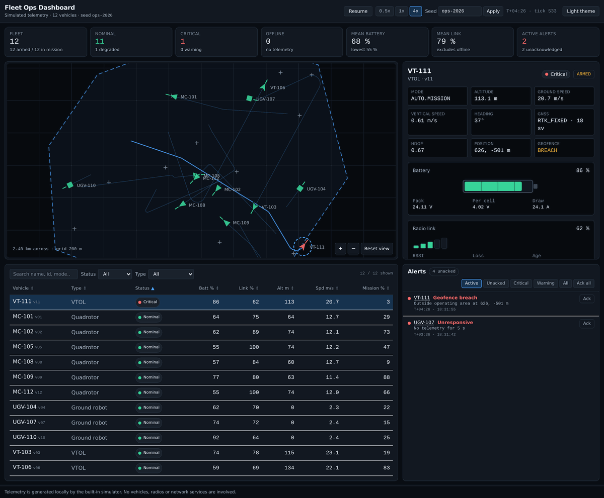
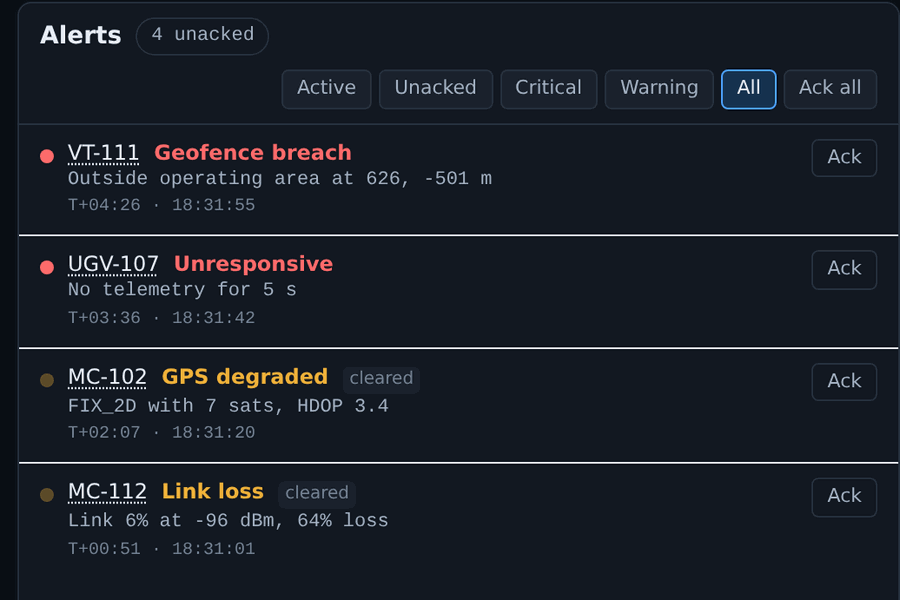

# fleet-ops-dashboard

A browser ground-station dashboard for watching a mixed fleet of drones and ground robots, running against a telemetry simulator that ships with it.


## Screenshots

Both are the running app on the built-in simulator, seed `ops-2026`. Nothing is mocked; the
telemetry, the fault, and the alerts were all produced by the simulation in the page.


VT-111 selected four minutes into the run. It has crossed the fence line at 626, -501 m, so its marker turns red on the map, its geofence field reads BREACH, and it sorts to the top of the fleet table as the one critical vehicle.


The alert feed with the history filter on. Two alerts are live and two have cleared and stayed in the log. Each rule has separate enter and exit thresholds and a dwell timer, so a signal sitting on a limit produces one entry rather than a hundred.

## The problem

Once you have more than two or three vehicles, the ground station stops being a
per-vehicle problem and becomes a fleet problem. The operator does not need
another artificial horizon. They need to know which of the twelve vehicles is
about to become someone's afternoon: which pack is sagging under load, which
radio has started dropping frames, which one has quietly stopped talking, and
which one has drifted over the fence line on a turn.

The second problem is that you cannot build or evaluate that UI without
telemetry, and telemetry means hardware, a radio, and a flight line. So the
dashboard never gets built, or it gets built against a static JSON fixture that
never degrades, never drops out, and never teaches you anything about how the
alert logic behaves at a threshold.

This repo solves the second problem so that it can solve the first. The
telemetry backend is a real simulation that injects real failures, and the
dashboard is a real front end wired to it.

## What it does

- Simulates ~12 vehicles (quadrotor, VTOL, ground) flying generated missions
  inside a geofenced operating area, at a fixed 0.5 s timestep.
- Models battery state of charge, pack voltage sag under load, link RSSI with
  path loss and packet loss, GNSS fix quality, flight mode, armed state,
  altitude, ground speed and mission progress.
- Injects five classes of fault on a seed-derived schedule: radio link drop,
  battery sag, GNSS degradation, geofence breach, and a vehicle that stops
  transmitting entirely.
- Derives alerts from that telemetry with per-rule enter/exit thresholds and
  dwell timers, so a signal sitting on a threshold produces one alert rather
  than a hundred.
- Draws a pan/zoom top-down map as inline SVG: heading-oriented markers, trails,
  the geofence polygon, home positions, selection highlight. No map library, no
  tile server, works offline.
- Draws three trend charts per selected vehicle (altitude, pack voltage, RSSI)
  from a fixed-capacity rolling buffer. No charting library; they are polylines
  this repo generates.
- Sorts, filters and searches the fleet table; every column is keyboard sortable
  and every row is keyboard selectable.
- Reproduces a scenario exactly from a seed string, with pause/resume and a
  0.5x / 1x / 4x speed control.

## Quickstart

```bash
npm install
npm run dev          # dashboard on http://localhost:5173
```

No hardware, no broker, no backend service. The simulator runs in the page.

If you would rather see the engine without a browser:

```bash
npm run demo             # headless trace with the default seed
npm run demo -- my-seed  # any seed string reproduces its own scenario
```

Other scripts:

```bash
npm run test         # Vitest, pure-logic suite, environment: node
npm run typecheck    # tsc -b, strict
npm run build        # type check then production bundle into dist/
```

## How it works

```
                    ┌──────────────────────────────────────────┐
                    │            src/lib/fleet-sim.ts          │
                    │  FleetSimulation                         │
   seed string ───► │   · seeded PRNG (mulberry32, no Math.random)
                    │   · per-vehicle route + power + radio    │
                    │   · fault schedule derived from the seed │
                    └────────────────┬─────────────────────────┘
                                     │ step()  fixed dt = 0.5 s
                                     ▼
                             FleetSnapshot
                (tick, simTimeS, vehicles[], geofence[])
                                     │
        ┌────────────────────────────┼─────────────────────────────┐
        ▼                            ▼                             ▼
┌───────────────┐          ┌───────────────────┐        ┌────────────────────┐
│ RingBuffer    │          │ src/lib/alerts.ts │        │ src/lib/fleet-     │
│ per vehicle   │          │ AlertEngine       │        │ table.ts           │
│ 300 samples   │          │  enter/exit       │        │  sort + filter +   │
│ alt / V / RSSI│          │  thresholds       │        │  fleet summary     │
└───────┬───────┘          │  + dwell timers   │        └─────────┬──────────┘
        │                  └─────────┬─────────┘                  │
        │                            │ Alert[]                    │
        ▼                            ▼                            ▼
┌──────────────────────────────────────────────────────────────────────────┐
│                    src/hooks/useFleetTelemetry.ts                        │
│      owns the sim, the engine, the history buffers and the trails        │
└───────────────────────────────┬──────────────────────────────────────────┘
                                ▼
┌──────────────────────────────────────────────────────────────────────────┐
│  App.tsx                                                                 │
│   SummaryStrip · FleetMap (SVG viewBox pan/zoom) · VehicleDetail          │
│   (BatteryGauge, LinkQuality, MissionProgress, 3x Sparkline)             │
│   FleetTable + FleetFilters · AlertFeed (aria-live) · PlaybackControls   │
└──────────────────────────────────────────────────────────────────────────┘
```

Data flows one way. The simulation never knows an alert exists, and the alert
engine never knows a fault was scheduled — it only sees telemetry fields.

### The telemetry engine

`FleetSimulation` is constructed from a seed string. That seed drives
everything: home positions, mission waypoints, starting state of charge, sensor
noise, and the fault schedule. There is no `Math.random()` anywhere in the
simulation and no wall-clock delta in the physics. `step()` always advances
exactly `SIM_DT_S`, so a run is defined by (seed, number of steps) and nothing
else. The UI's speed multiplier changes how often `step()` is called, not what
it computes — pausing, running at 4x and running at 0.5x all produce the same
state at the same tick.

Per tick, each vehicle:

1. **Navigates.** It turns toward its next waypoint at a bounded turn rate and
   integrates position. The bounded turn rate is why vehicles occasionally
   overshoot a waypoint close to the fence — see the worked example below.
2. **Burns power.** Current is `idle + k_speed·|v| + k_climb·climb`, scaled by
   any active fault. State of charge integrates that current against pack
   capacity and is monotonically non-increasing. Pack voltage is a piecewise
   linear open-circuit curve minus `I·R_internal`, so a sagging pack reads low
   under load and recovers when it stops climbing.
3. **Reports GNSS.** Satellite count and HDOP drift slowly, then collapse under
   a GPS fault. The fix type (`RTK_FIXED` … `NO_FIX`) is derived from those two
   numbers rather than set directly.
4. **Reports its radio.** RSSI is a −45 dBm reference at 50 m plus 20·log10
   range path loss plus gaussian noise, minus any active link fault. Packet loss
   follows RSSI. Link quality is derived from both.

Faults are envelopes, not switches: each ramps in and out over several seconds,
so the alert rules have to cope with a signal crossing a threshold gradually
rather than a clean step. A vehicle under the `UNRESPONSIVE` fault simply stops
producing frames — the ground station keeps the last known state and ages it,
which is what actually drives the alert.

### Alerts

Each rule is `{enter, exit, enterDwellS, exitDwellS}`. Low battery enters at
30% and exits at 33%; link loss enters at 25% quality or 40% packet loss and
exits at 35% quality *and* 25% loss. A rule must hold its enter condition for
the dwell before it latches, and hold its exit condition for a longer dwell
before it clears. That combination is what stops a noisy telemetry stream from
producing alert chatter, and it is tested directly: a signal oscillating either
side of the enter threshold produces exactly one alert, and no alert at all if
it never holds long enough to latch.

## Worked example

Real output from `npm run demo`, unedited:

```
$ npm run demo

seed=ops-2026  dt=0.5s  horizon=600s

injected fault schedule
  LINK_DROP        vehicle #11 T+00:43 .. T+02:03
  BATTERY_SAG      vehicle # 4 T+01:13 .. T+07:03
  GPS_DEGRADED     vehicle # 1 T+02:00 .. T+03:13
  GEOFENCE_BREACH  vehicle # 8 T+02:47 .. T+03:53
  UNRESPONSIVE     vehicle # 6 T+03:27 .. T+04:30

fleet at T+10:00
  vehicle   type       status    batt%  link%  alt m  mode
  MC-101    quadrotor  offline      51     76     54  AUTO.MISSION
  MC-102    quadrotor  nominal      46     90     50  AUTO.MISSION
  VT-103    vtol       nominal      56     77    134  AUTO.MISSION
  UGV-104   ground     nominal      58     83      0  OFFBOARD
  MC-105    quadrotor  warning      28     69     53  AUTO.MISSION
  VT-106    vtol       nominal      49     94    111  AUTO.MISSION
  UGV-107   ground     nominal      70    100      0  OFFBOARD
  MC-108    quadrotor  nominal      41     93     71  AUTO.MISSION
  MC-109    quadrotor  nominal      61     89     47  AUTO.MISSION
  UGV-110   ground     nominal      88     89      0  OFFBOARD
  VT-111    vtol       nominal      76     70    114  AUTO.MISSION
  MC-112    quadrotor  nominal      39     74     49  AUTO.MISSION

alerts derived from that telemetry (newest first)
  T+09:14  warning  active   MC-105    Low battery       Battery 30% (22.0 V)
  T+08:57  critical active   MC-101    Unresponsive      No telemetry for 5 s
  T+08:51  critical cleared  VT-111    Geofence breach   Outside operating area at 618, -549 m
  T+06:39  critical cleared  VT-111    Geofence breach   Outside operating area at 620, -546 m
  T+06:17  warning  cleared  MC-101    Link loss         Link 5% at -96 dBm, 70% loss
  T+04:26  critical cleared  VT-111    Geofence breach   Outside operating area at 626, -501 m
  T+03:36  critical cleared  UGV-107   Unresponsive      No telemetry for 5 s
  T+02:07  warning  cleared  MC-102    GPS degraded      FIX_2D with 7 sats, HDOP 3.4
  T+00:51  warning  cleared  MC-112    Link loss         Link 6% at -96 dBm, 64% loss
```

Two things worth reading off that output.

First, the alert list does not match the fault schedule, and that is the point.
`GEOFENCE_BREACH` was scheduled once, on vehicle #8, but the feed shows three
breaches on VT-111 — a VTOL with a 25°/s turn rate that overshoots a waypoint
sitting close to the southeast fence line, three times, on three passes of the
same mission. Nothing scripted that. The alert engine ran a point-in-polygon
test on a position that the navigation model produced.

Second, MC-101 is `offline` with a link quality of 76%. Those are consistent:
the last frame it managed to send reported a healthy radio, and the ground
station is showing you that stale frame while telling you it is stale.

Re-run `npm run demo` and you get exactly this again. Run
`npm run demo -- something-else` and you get a different fleet, different
missions and a different fault schedule.

## Feature walkthrough

Open the dashboard and, top to bottom:

- **Header.** Playback transport: pause/resume, 0.5x / 1x / 4x, and a seed field.
  Applying a seed rebuilds the fleet, the missions and the fault schedule from
  scratch and clears the history buffers. The theme toggle sits on the right and
  persists to `localStorage`.
- **Summary strip.** Fleet count, armed and in-mission counts, status counts,
  mean and minimum battery, mean link quality, and active/unacknowledged alert
  counts. Every figure is recomputed from the current snapshot.
- **Map.** Drag to pan, wheel or the +/− buttons to zoom, "Reset view" to return.
  Marker shape encodes airframe class (triangle multirotor, swept arrow VTOL,
  square ground robot); marker colour encodes status; the stalk shows heading.
  Trails come from a 120-point ring buffer per vehicle and the selected trail is
  drawn brighter. Dashed polygon is the geofence; small crosses are home points.
  Markers are focusable and respond to Enter or Space.
- **Detail panel.** For the selected vehicle: mode, altitude, ground and vertical
  speed, heading, GNSS fix and satellite count, HDOP, position, geofence state;
  then a battery gauge with pack and per-cell voltage and current draw, a link
  panel with RSSI, packet loss and telemetry age, a mission progress bar, and
  three trend charts.
- **Fleet table.** Click any header to sort, click again to reverse; headers are
  buttons with `aria-sort`, so this works from the keyboard and is announced.
  Filter by status and type, or type into the search box, which matches name, id,
  type, mode, status and GNSS fix.
- **Alert feed.** Newest first, filterable by active / unacknowledged / severity,
  with per-alert and bulk acknowledge. The list is an `aria-live="polite"`
  region. Clicking the vehicle name in an alert selects that vehicle everywhere.

## What this handles that a tutorial dashboard does not

- **Stale telemetry is not missing telemetry.** A vehicle that stops
  transmitting keeps its last known values on screen, with an age counter, and
  is marked offline. It does not blank out and it does not silently freeze
  pretending to be healthy.
- **Threshold chatter.** Every alert rule has a dead band and a dwell timer.
  This is the difference between an alert feed an operator reads and one they
  turn off.
- **Voltage under load.** A pack at 40% reads differently while climbing than
  while loitering. The gauge shows per-cell voltage and current draw next to
  each other because that is what tells you whether you are looking at a sag or
  a genuinely flat pack.
- **Reproducibility.** Fixed timestep, seeded PRNG, no wall-clock in the
  physics. A scenario is a string. Alert-logic bugs are reproducible instead of
  being "it did it once yesterday".
- **Derived, not scripted.** Alerts read telemetry fields. That is why the
  worked example shows a geofence alert nobody scheduled.
- **Accessibility and theming as constraints, not a retrofit.** Semantic
  landmarks, keyboard-operable sorting and selection, visible focus rings,
  `aria-live` on the feed, status conveyed by shape and text as well as colour,
  and every colour as a CSS custom property with a `[data-theme]` override so
  neither theme is trapped inside a media query.

## Testing

```bash
npm run test
```

The suite covers pure logic only and runs in `environment: 'node'` — no jsdom,
no component rendering. It asserts:

- the simulation is byte-identical for the same seed after N ticks, and differs
  for a different seed;
- `reset()` replays the same run;
- the fault schedule is seed-derived, ordered, and covers all five fault kinds;
- a long run really does drive telemetry past the alert thresholds;
- battery state of charge is monotonically non-increasing under load, drains
  faster at higher current, and floors at zero;
- pack voltage sags by exactly `I·R` and the open-circuit curve is monotonic;
- alert hysteresis: no latch while a signal only flickers over the threshold,
  exactly one alert while it sits on the threshold after latching, a clear only
  after the exit dwell, and a genuine re-raise after a real recovery;
- alert filtering, acknowledgement, feed capping and reset;
- table sorting (numeric, alphabetic, worst-status-first, stable tie-break,
  non-mutating), filtering, search and fleet aggregation;
- point-in-polygon on convex and concave polygons, including a concave notch;
- the rolling history buffer capping at capacity and preserving sample order.

## Limitations

Read this section before assuming anything.

- **This is a front end with a simulated backend.** There is no server, no
  database, no MAVLink connection and no radio. Nothing in this repo talks to a
  real vehicle. The simulator is a plausible model, not a validated one.
- **The physics is a kinematic model, not a flight dynamics model.** Vehicles
  turn at a bounded rate and integrate position. There is no wind, no attitude
  loop, no aerodynamics, no VTOL transition modelling.
- **The battery model is a first-order approximation.** Piecewise-linear
  open-circuit curve, constant internal resistance, no temperature, no cell
  imbalance, no ageing.
- **The radio model is free-space path loss plus noise.** No terrain masking, no
  multipath, no antenna pattern, no interference.
- **Positions are a flat local ENU plane in metres.** There is no geodesy, no
  projection, no altitude datum. Wiring this to a real fleet would mean adding a
  lat/lon-to-local-tangent-plane conversion at the ingest boundary.
- **State is in-memory and per-tab.** Reloading the page starts a fresh run.
  Only the theme choice is persisted.
- **12 vehicles is the design point.** The table is not virtualised, because at
  this size virtualisation is complexity with no payoff. A fleet of hundreds
  would need windowing and a coarser map redraw.
- **No component tests.** The test suite deliberately covers pure logic only, to
  keep the toolchain small; there is no jsdom or Testing Library in the tree.

## Related work

Part of a set of robotics and product repos:

- [ground-station-mobile](https://github.com/Pratyush150/ground-station-mobile) — mobile ground-control app for telemetry and mission monitoring
- [px4-mavlink-companion](https://github.com/Pratyush150/px4-mavlink-companion) — MAVLink bridge, stale-telemetry watchdog, offboard control, link diagnostics
- [drone-control-toolkit](https://github.com/Pratyush150/drone-control-toolkit) — PID/LQR/EKF control and estimation with a simulation harness
- [flight-log-analyzer](https://github.com/Pratyush150/flight-log-analyzer) — PX4 ULog / ArduPilot log forensics with a ranked findings report
- [ros2-drone-bringup](https://github.com/Pratyush150/ros2-drone-bringup) — ROS 2 PX4 bringup: geodesy, missions, geofence, state machine, SITL
- [robot-sim-test-harness](https://github.com/Pratyush150/robot-sim-test-harness) — scenario-driven regression testing for robots in simulation
- [industrial-automation-suite](https://github.com/Pratyush150/industrial-automation-suite) — Modbus/OPC-UA acquisition, alarms, historian and a live dashboard

More at [github.com/Pratyush150](https://github.com/Pratyush150) and
[pratyush150.github.io](https://pratyush150.github.io).

## License

MIT — see [LICENSE](LICENSE).
